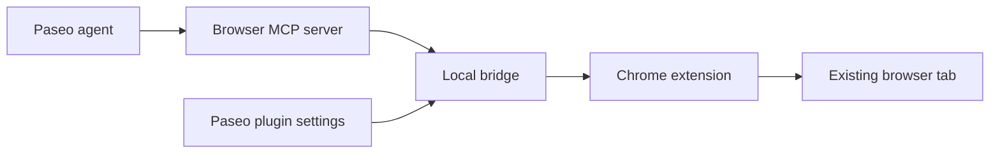
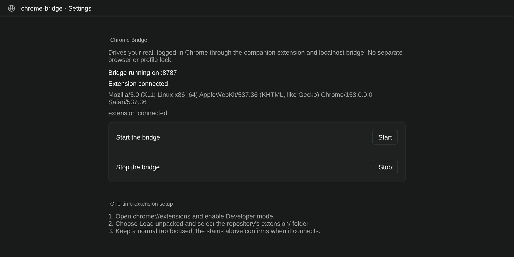

<div align="center">


# Paseo Chrome Bridge


[Features](#features) · [Getting started](#getting-started) · [Compatibility](#compatibility) · [Reference](docs/REFERENCE.md)

</div>

Give a Paseo agent access to your existing Chrome session through a local bridge and companion extension. The browser keeps its normal profile, logins, cookies, and network environment; the bridge sends commands to the browser you are already using.

## Features

| Feature | What you get |
| --- | --- |
| Existing browser session | Work in your normal logged-in Chrome instead of launching a second profile |
| Local transport | A Node bridge on `127.0.0.1` connects agents and the MV3 extension |
| Browser MCP tools | Search, fetch, inspect, click, type, and screenshot operations |
| Native plugin settings | Bridge status, extension status, and Start/Stop controls |
| One tab per agent | Each agent works in its own background tab; its calls run in order |
| Google search pacing | Google searches from all agents are spaced out; agents get a clear "retry in N seconds" |
| Companion utilities | Optional native desktop MCP tools and provider launch guards |

## How it fits



## Getting started

Clone to the folder expected by the compatibility plugin's existing launcher:

```bash
mkdir -p ~/Work
git clone https://github.com/papag00se/paseo-chrome-bridge.git ~/Work/chrome-bridge
cd ~/Work/chrome-bridge/bridge
npm ci
node server.mjs
```

In Chrome, open **chrome://extensions**, enable **Developer mode**, and use **Load unpacked** to select the repository's `extension/` directory. Each agent gets its own background tab in the "Paseo" tab group, closed when the agent ends. CDP focus emulation prepares those targets for trusted input without activating your foreground tab. After changing extension code, reload Chrome Bridge from `chrome://extensions`.

To add the Paseo 0.9.1 settings panel, in a separate terminal:

```bash
cd ~/Work/chrome-bridge/plugin-recovered-v091
npm ci --legacy-peer-deps
npm run typecheck
paseo plugin install "$PWD"
```

Open **Settings → Plugins → Chrome Bridge → Settings**. Start/Stop controls affect the bridge; simply opening settings reads its status. MCP registration is a separate step described in the [setup reference](docs/REFERENCE.md).



## Compatibility

The repository includes the original plugin in `plugin/` and the split-entry Paseo 0.9.1–0.9.x variant in `plugin-recovered-v091/`. The compatibility launcher currently expects `~/Work/chrome-bridge/bridge`; use that checkout location.

The bridge uses your active logged-in browser. Configure `BRIDGE_TOKEN` if you need to restrict local callers, and keep agent actions within the permissions you grant. Browser/desktop operations are externally visible; the plugin does not authorize them on its own.

The optional native desktop tools target Linux/Hyprland and are documented separately. They are not needed to use the Chrome bridge.

## Development

```bash
node --test mcp/tests/*.test.mjs
node --test guard/*.test.mjs
```

[Full setup, MCP tools, and transport details →](docs/REFERENCE.md) · [Desktop MCP](mcp/DESKTOP.md) · [Provider guards](guard/README.md)
